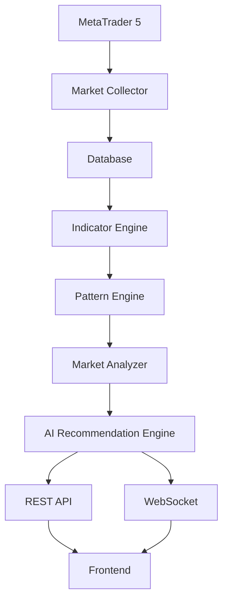
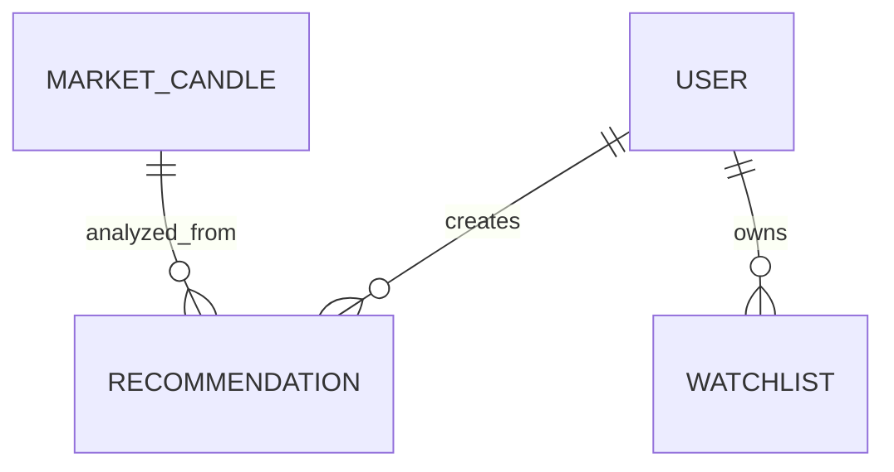
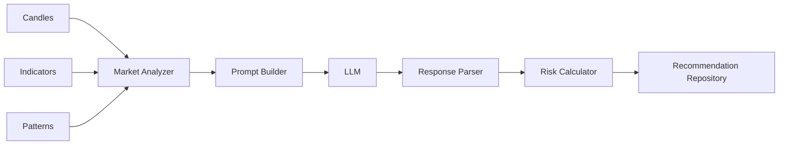
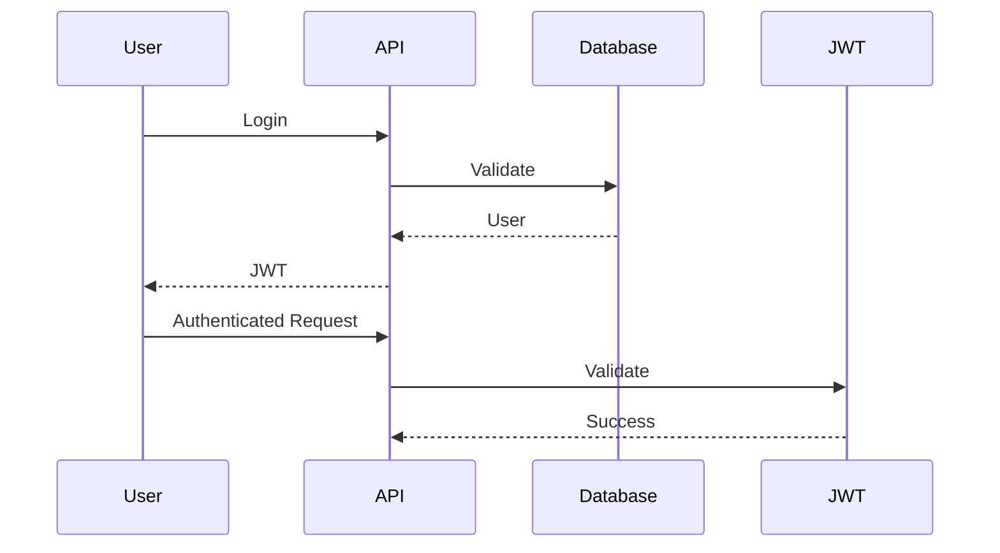

# Athena AI Terminal
# System Architecture

---

| Document Information | |
|----------------------|------------------------------------------------|
| Project | Athena AI Terminal |
| Document | System Architecture |
| Version | 1.0 |
| Status | Draft |
| Last Updated | July 2026 |
| Intended Audience | Software Architects, Developers, DevOps Engineers, QA Engineers, Stakeholders, AI Assistants |

---

# Table of Contents

1. Introduction
2. Architecture Goals
3. Design Principles
4. System Overview
5. High-Level Architecture
6. Backend Architecture
7. Frontend Architecture
8. Database Architecture
9. AI Architecture
10. Market Data Flow
11. Trading Analysis Flow
12. Recommendation Pipeline
13. Scheduler Architecture
14. API Architecture
15. WebSocket Architecture
16. Authentication Architecture
17. Logging Architecture
18. Error Handling
19. Request Lifecycle
20. Project Layers
21. Component Responsibilities
22. Dependency Flow
23. Scalability
24. Security
25. Future Architecture

---

# 1. Introduction

Athena AI Terminal is designed as a modular, scalable, service-oriented trading platform that combines traditional technical analysis, Smart Money Concepts (SMC), artificial intelligence, and MetaTrader 5 (MT5) into a single ecosystem.

Rather than implementing a monolithic application, Athena follows a layered architecture where each module has a single responsibility and communicates with other modules through clearly defined interfaces.

This approach provides:

- High maintainability
- Easy testing
- Better scalability
- Easier onboarding
- Separation of concerns
- Cleaner dependency management

---

# 2. Architecture Goals

The architecture was designed with the following objectives:

- Modular Design
- High Performance
- Low Coupling
- High Cohesion
- Easy Testing
- AI Extensibility
- Multi-Broker Support
- Future Cloud Deployment
- Real-Time Market Streaming
- Scalability

---

# 3. Design Principles

Athena follows several well-established software engineering principles.

## SOLID Principles

- Single Responsibility Principle
- Open / Closed Principle
- Liskov Substitution Principle
- Interface Segregation Principle
- Dependency Inversion Principle

---

## Clean Architecture

Business logic remains independent of:

- Frameworks
- Database
- MT5
- AI provider
- REST API
- Frontend

---

## Layered Architecture

```
Presentation Layer

↓

Application Layer

↓

Business Layer

↓

Repository Layer

↓

Database
```

---

# 4. System Overview

```
                 +----------------------+
                 |      Frontend        |
                 | React + TypeScript   |
                 +----------+-----------+
                            |
          REST API          |         WebSocket
                            |
                +-----------v------------+
                |       FastAPI          |
                +-----------+------------+
                            |
       +--------------------+----------------------+
       |                    |                      |
       |                    |                      |
Authentication      Market Services      AI Services
       |                    |                      |
       +--------------------+----------------------+
                            |
                    Business Logic
                            |
        +-------------------+--------------------+
        |                   |                    |
Indicator Engine    Pattern Engine      Risk Engine
        |                   |                    |
        +-------------------+--------------------+
                            |
                  Market Analyzer
                            |
                Recommendation Engine
                            |
                     PostgreSQL
                            |
                     MT5 Connector
                            |
                    MetaTrader 5
```

---

# 5. High-Level Architecture



---

# 6. Backend Architecture

The backend is responsible for:

- Authentication
- Market Collection
- Technical Analysis
- Pattern Detection
- AI Recommendation
- Database Management
- API
- Scheduler
- Logging

Directory layout:

```
app/

api/

services/

repositories/

models/

schemas/

analysis/

patterns/

indicators/

mt5/

scheduler/

core/

database/

ai/
```

Each module has a dedicated responsibility.

---

# 7. Frontend Architecture

The frontend communicates exclusively through:

- REST APIs
- WebSockets

Responsibilities include:

- Dashboard
- Charts
- Recommendations
- Authentication
- User Settings
- Live Updates

No trading logic exists inside the frontend.

---

# 8. Database Architecture

Database Engine:

PostgreSQL

Primary entities include:

- Users
- Market Candles
- Recommendations
- Watchlists
- Settings

Data relationships:



---

# 9. AI Architecture

Athena supports interchangeable AI providers.

Current implementation:

```
Market Analyzer

↓

Prompt Builder

↓

LLM Client

↓

Ollama

↓

Response Parser

↓

Recommendation
```

Future providers may include:

- OpenAI
- Claude
- Gemini
- Azure OpenAI
- AWS Bedrock

The business logic remains independent of the LLM provider.

---

# 10. Market Data Flow

```mermaid
flowchart TD

MT5

↓

Collector

↓

Validation

↓

Deduplication

↓

Database

↓

Indicators

↓

Patterns

↓

Analysis
```

Each candle passes through validation before storage.

---

# 11. Trading Analysis Flow

```
Candles

↓

EMA

↓

RSI

↓

MACD

↓

ATR

↓

Pattern Detection

↓

Trend Detection

↓

Confluence

↓

AI Recommendation
```

---

# 12. Recommendation Pipeline



---

# 13. Scheduler Architecture

Scheduler responsibilities:

- Collect candles
- Trigger analysis
- Save recommendations
- Future maintenance jobs

Example:

```
Every Minute

↓

Collect Candles

↓

Store Database

↓

Run Analysis

↓

Generate Recommendation

↓

Save Recommendation
```

---

# 14. API Architecture

REST API follows:

```
Client

↓

Router

↓

Service

↓

Repository

↓

Database
```

The API layer contains no business logic.

---

# 15. WebSocket Architecture

WebSocket responsibilities:

- Live candle updates
- Live recommendations
- Notifications
- Future order updates

```
Market Update

↓

Broadcast

↓

Connected Clients
```

---

# 16. Authentication Architecture

Authentication uses JWT.

Workflow:



---

# 17. Logging Architecture

Logging captures:

- Requests
- Errors
- Scheduler
- MT5
- AI
- Authentication
- Database

Log levels:

- DEBUG
- INFO
- WARNING
- ERROR
- CRITICAL

---

# 18. Error Handling

Every layer handles only its own responsibility.

```
Repository

↓

Service

↓

API

↓

HTTP Response
```

Unexpected exceptions are captured by global exception handlers.

---

# 19. Request Lifecycle

```
HTTP Request

↓

FastAPI Router

↓

Authentication

↓

Service Layer

↓

Repository

↓

Database

↓

Service

↓

Schema

↓

JSON Response
```

---

# 20. Project Layers

| Layer | Responsibility |
|---------|----------------|
| Presentation | REST + WebSocket |
| Service | Business Logic |
| Analysis | Market Intelligence |
| Repository | Database Access |
| Database | Persistence |
| Infrastructure | MT5 + Scheduler |
| AI | Recommendations |

---

# 21. Component Responsibilities

| Component | Responsibility |
|------------|----------------|
| MT5 | Market Data |
| Collector | Data Collection |
| Repository | Persistence |
| Indicator Engine | Indicators |
| Pattern Engine | SMC Detection |
| Market Analyzer | Market Summary |
| Prompt Builder | AI Prompt |
| AI Client | LLM Communication |
| Response Parser | AI Validation |
| Risk Engine | SL / TP |
| Recommendation Repository | Storage |

---

# 22. Dependency Flow

Dependencies always flow downward.

```
Frontend

↓

API

↓

Services

↓

Repositories

↓

Database
```

Business logic never depends directly on the frontend.

---

# 23. Scalability

Athena is designed to scale horizontally.

Future improvements:

- Redis Cache
- Celery Workers
- Kafka
- RabbitMQ
- Kubernetes
- Multiple AI Providers
- Multiple MT5 Terminals
- Multi-Database Support

---

# 24. Security

Security measures include:

- JWT Authentication
- Password Hashing
- Environment Variables
- SQLAlchemy ORM
- Input Validation
- Pydantic Models
- HTTPS Ready
- CORS Protection

Future enhancements:

- RBAC
- MFA
- Audit Logs
- API Rate Limiting

---

# 25. Future Architecture

Planned architectural enhancements:

- Microservices
- Event-Driven Architecture
- AI Agent Framework
- Strategy Marketplace
- Plugin System
- Distributed Scheduler
- Portfolio Management
- Risk Dashboard
- Cloud Native Deployment
- Multi-Broker Infrastructure

---

# Related Documents

- 01_Project_Overview.md
- 03_Folder_Structure.md
- 04_Technology_Stack.md
- 05_Backend_Architecture.md
- 06_Database_Design.md
- 07_MT5_Integration.md
- 08_AI_Architecture.md
- 09_API_Documentation.md
- 10_Developer_Guide.md
- 99_AI_Continuation_Context.md

---

**Document End**

© Athena AI Terminal Project
