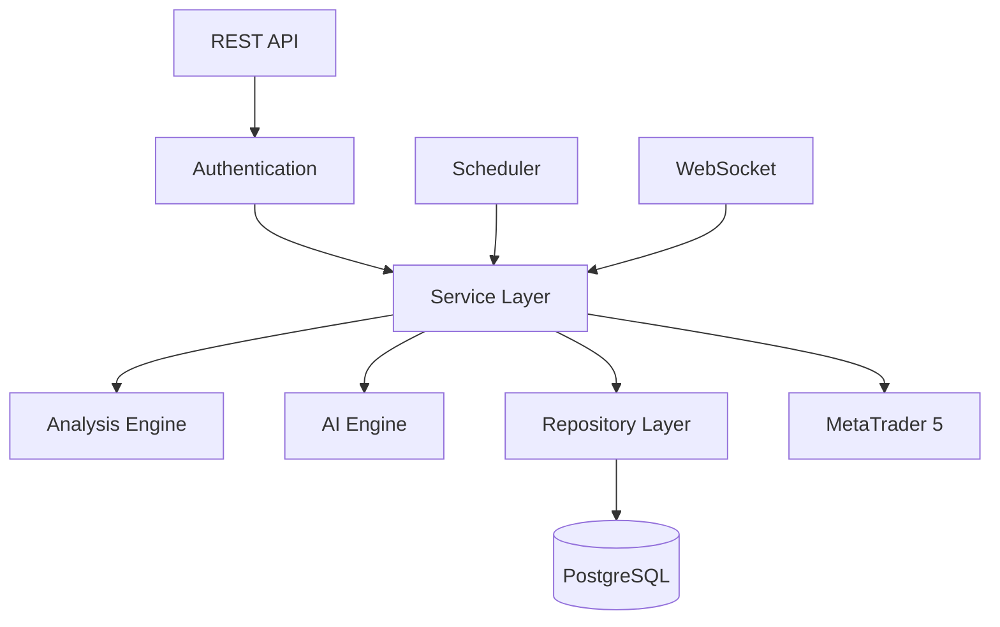
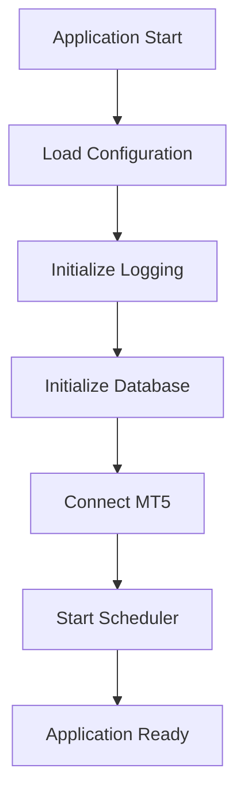
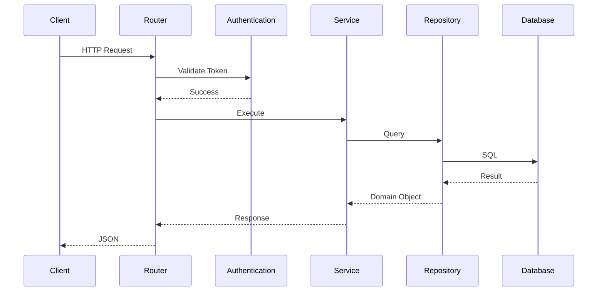

# Athena AI Terminal
# Backend Architecture

---

| Document Information | |
|----------------------|------------------------------------------------|
| Project | Athena AI Terminal |
| Document | Backend Architecture |
| Version | 1.0 |
| Status | Living Document |
| Last Updated | July 2026 |
| Audience | Backend Developers, Architects, DevOps Engineers, QA Engineers, AI Assistants |

---

# Table of Contents

1. Introduction
2. Backend Goals
3. Design Philosophy
4. High-Level Backend Architecture
5. Backend Layers
6. Package Responsibilities
7. Dependency Rules
8. Application Lifecycle
9. Request Lifecycle
10. Background Job Lifecycle
11. Data Processing Pipeline
12. Repository Pattern
13. Service Layer
14. Dependency Injection
15. Database Integration
16. MT5 Integration
17. AI Integration
18. Scheduler
19. Authentication
20. Logging
21. Error Handling
22. Configuration
23. Performance Considerations
24. Scalability Strategy
25. Security
26. Development Guidelines
27. Future Improvements

---

# 1. Introduction

The backend is the core of Athena AI Terminal.

It is responsible for:

- User authentication
- Market data collection
- Technical analysis
- Smart Money Concept analysis
- AI recommendation generation
- Historical storage
- Background scheduling
- REST APIs
- WebSocket communication
- Risk management
- Future automated trading

The backend is intentionally designed to separate business logic from infrastructure.

---

# 2. Backend Goals

The backend was designed with the following objectives:

- Modular
- Testable
- Scalable
- Replaceable
- Extensible
- Production Ready

Every component should have one responsibility.

---

# 3. Design Philosophy

Athena follows a layered architecture.

```
Presentation

↓

Application

↓

Business Logic

↓

Repository

↓

Persistence
```

No layer should bypass another layer.

---

# 4. High-Level Backend Architecture



---

# 5. Backend Layers

Athena is organized into logical layers.

| Layer | Responsibility |
|--------|----------------|
| API | HTTP endpoints |
| Authentication | Identity & access |
| Service | Business logic |
| Analysis | Market intelligence |
| AI | Recommendation generation |
| Repository | Data access |
| Database | Persistence |
| Infrastructure | MT5, Scheduler, Logging |

---

# 6. Package Responsibilities

## api/

Responsible for:

- REST endpoints
- API routing
- Request validation
- Response serialization

Business logic is **not allowed** here.

---

## services/

The orchestration layer.

Responsibilities:

- Coordinate repositories
- Invoke analyzers
- Execute business rules
- Handle transactions
- Return domain results

The majority of application logic belongs here.

---

## repositories/

Provides all database operations.

Responsibilities:

- CRUD
- Filtering
- Pagination
- Queries
- Transactions

Repositories must not contain business logic.

---

## models/

Defines SQLAlchemy ORM models.

Each model maps to a database table.

No service logic belongs here.

---

## schemas/

Contains Pydantic models.

Responsibilities:

- Request validation
- Response validation
- Serialization

---

## analysis/

Produces market intelligence.

Combines:

- Indicators
- Patterns
- Trend
- Confluence

Returns a compact market summary for downstream consumers.

---

## indicators/

Calculates technical indicators.

Each indicator is isolated in its own module.

Examples:

- EMA
- RSI
- MACD
- ATR

---

## patterns/

Detects Smart Money Concepts.

Examples:

- BOS
- CHOCH
- Order Blocks
- Liquidity
- FVG
- Premium / Discount

---

## ai/

Handles AI interaction.

Components include:

- Prompt Builder
- AI Client
- Response Parser
- Recommendation Engine

The AI layer is isolated so the LLM provider can be replaced without affecting business logic.

---

## mt5/

Encapsulates all MetaTrader 5 communication.

Responsibilities:

- Connection management
- Candle retrieval
- Symbol metadata
- Future order execution

No other package should communicate directly with the MT5 SDK.

---

## scheduler/

Runs background jobs.

Current responsibilities:

- Candle collection
- Market analysis
- Recommendation generation

Future jobs:

- Cleanup
- Maintenance
- Reporting

---

## core/

Shared infrastructure.

Includes:

- Settings
- Logger
- Middleware
- Constants
- Exceptions
- Lifespan management

---

# 7. Dependency Rules

Allowed dependency flow:

```
API

↓

Service

↓

Repository

↓

Database
```

Business logic should never depend directly on:

- FastAPI
- PostgreSQL
- MT5 SDK
- Ollama

Instead, dependencies are accessed through dedicated layers.

---

# 8. Application Lifecycle



Shutdown sequence:

1. Stop scheduler.
2. Close database sessions.
3. Disconnect MT5.
4. Flush logs.
5. Exit.

---

# 9. Request Lifecycle

Every HTTP request follows the same path.



---

# 10. Background Job Lifecycle

```mermaid
flowchart TD

Scheduler

↓

Collect Candles

↓

Validate

↓

Deduplicate

↓

Store

↓

Analyze

↓

Generate Recommendation

↓

Persist Recommendation
```

Background jobs are designed to run independently of incoming API requests.

---

# 11. Data Processing Pipeline

Market data flows through multiple processing stages.

```
MT5

↓

Raw Candle

↓

Validation

↓

Database

↓

Indicator Calculation

↓

Pattern Detection

↓

Market Analysis

↓

AI Recommendation

↓

Recommendation Storage
```

Each stage is isolated and independently testable.

---

# 12. Repository Pattern

Repositories abstract database access.

Benefits:

- Cleaner services
- Easier testing
- Database independence
- Query reuse

Services interact with repositories instead of ORM models directly.

---

# 13. Service Layer

The service layer coordinates all business operations.

Typical responsibilities:

- Validate input
- Load data
- Execute business rules
- Invoke analysis
- Persist results
- Return domain objects

Services should remain framework-agnostic.

---

# 14. Dependency Injection

FastAPI's dependency injection is used to:

- Provide database sessions
- Inject authenticated users
- Share configuration
- Manage repositories

This improves modularity and testing.

---

# 15. Database Integration

The backend communicates with PostgreSQL exclusively through SQLAlchemy.

Key principles:

- ORM models represent tables.
- Repositories perform queries.
- Services never execute raw SQL.
- Transactions are explicit.

---

# 16. MT5 Integration

The MT5 package isolates all interaction with the MetaTrader 5 terminal.

Responsibilities include:

- Terminal connection
- Historical candles
- Live market data
- Symbol information

This abstraction allows future broker integrations without changing business logic.

---

# 17. AI Integration

The AI workflow is intentionally modular.

```mermaid
flowchart LR

Analysis

-->

Prompt Builder

-->

AI Client

-->

LLM

-->

Response Parser

-->

Recommendation
```

Only structured market summaries are provided to the LLM.

---

# 18. Scheduler

The scheduler automates recurring tasks.

Current schedule:

- Candle collection
- Analysis
- Recommendation generation

Future schedule:

- Database cleanup
- Cache refresh
- Reports
- Health checks

---

# 19. Authentication

JWT is used for stateless authentication.

Responsibilities:

- Login
- Token generation
- Token validation
- User authorization

Future enhancements:

- Refresh tokens
- RBAC
- MFA

---

# 20. Logging

The backend logs:

- Startup
- Shutdown
- Requests
- Scheduler jobs
- MT5 events
- AI requests
- Errors

Logging is centralized and configurable.

---

# 21. Error Handling

Each layer handles its own concerns.

Repositories raise data-related exceptions.

Services translate business failures.

API returns appropriate HTTP responses.

Unexpected exceptions are captured globally.

---

# 22. Configuration

Application configuration is centralized.

Primary sources:

- Environment variables
- `.env`
- Settings class

Secrets should never be hardcoded.

---

# 23. Performance Considerations

Design decisions prioritize:

- Reusable database sessions
- Compact AI prompts
- Minimal duplicate queries
- Background processing
- Efficient indicator calculations

Future improvements:

- Redis caching
- Async workers
- Batch processing

---

# 24. Scalability Strategy

Athena is designed to evolve toward:

- Multi-symbol processing
- Multi-timeframe analysis
- Distributed scheduling
- Horizontal scaling
- Multiple AI providers
- Multiple broker integrations

The architecture intentionally minimizes coupling to support these goals.

---

# 25. Security

Current measures:

- JWT authentication
- Password hashing
- Environment-based secrets
- ORM protection against SQL injection
- Pydantic validation

Planned:

- Role-Based Access Control (RBAC)
- Multi-Factor Authentication (MFA)
- API rate limiting
- Audit logging

---

# 26. Development Guidelines

When contributing to the backend:

- Keep modules focused.
- Avoid circular imports.
- Use dependency injection.
- Add type hints.
- Document public APIs.
- Write tests for new features.
- Keep business logic out of routers and repositories.

---

# 27. Future Improvements

Planned architectural enhancements:

- Async database support
- Redis cache
- Celery workers
- Event-driven messaging
- Plugin system
- Strategy engine
- Multi-broker infrastructure
- AI provider abstraction
- Cloud-native deployment

---

# Related Documents

- 01_Project_Overview.md
- 02_System_Architecture.md
- 03_Folder_Structure.md
- 04_Technology_Stack.md
- 06_Database_Design.md
- 07_MT5_Integration.md
- 08_AI_Architecture.md
- 09_API_Documentation.md
- 10_Developer_Guide.md
- 99_AI_Continuation_Context.md

---

## Revision History

| Version | Date | Description |
|----------|------|-------------|
| 1.0 | July 2026 | Initial backend architecture documentation |

---

**Document End**

© Athena AI Terminal Project
