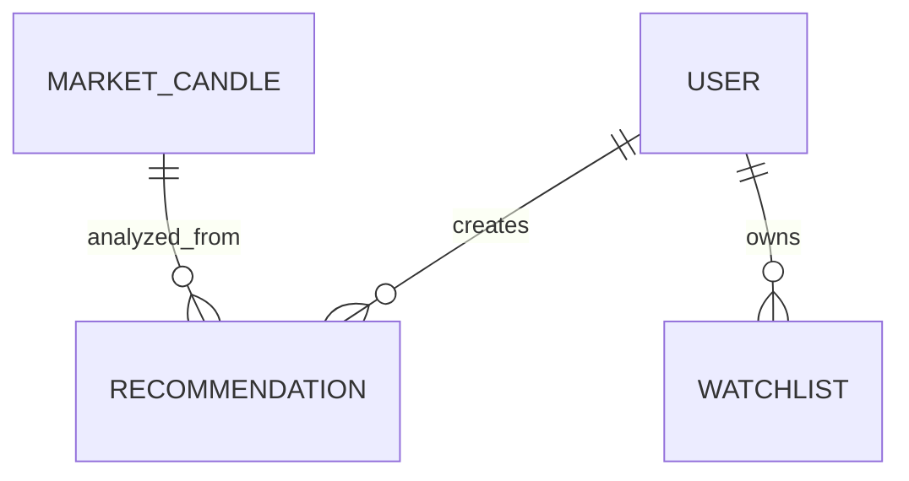

# Athena AI Terminal
# Database Design

---

| Document Information | |
|----------------------|------------------------------------------------|
| Project | Athena AI Terminal |
| Document | Database Design |
| Version | 1.0 |
| Status | Living Document |
| Last Updated | July 2026 |
| Audience | Database Engineers, Backend Developers, DevOps Engineers, QA Engineers, AI Assistants |

---

# Table of Contents

1. Introduction
2. Database Goals
3. Why PostgreSQL
4. Database Architecture
5. Database Naming Standards
6. Schema Overview
7. Entity Relationship Diagram
8. Table Documentation
9. Relationships
10. Constraints
11. Index Strategy
12. Transactions
13. Repository Pattern
14. Database Sessions
15. Migrations
16. Performance
17. Backup Strategy
18. Future Database Growth
19. Best Practices
20. Appendix

---

# 1. Introduction

The Athena database is responsible for storing all persistent application data.

Unlike temporary market calculations performed in memory, the database acts as the permanent source of truth for:

- Users
- Authentication
- Historical market candles
- AI recommendations
- Watchlists
- User preferences
- Future portfolios
- Future trade history
- Future strategy results

The database has been designed with long-term scalability in mind.

---

# 2. Database Goals

The database architecture follows several principles.

Primary goals:

- Data Integrity
- High Performance
- Scalability
- Normalization
- Simplicity
- Easy Maintenance
- Future Expansion

---

# 3. Why PostgreSQL

PostgreSQL was selected because it provides:

- ACID Compliance
- Excellent indexing
- JSON support
- Strong transaction management
- Mature ecosystem
- Large community
- Enterprise reliability

Future compatibility:

- Read Replicas
- Partitioning
- Logical Replication
- High Availability

---

# 4. Database Architecture

```text
Application

↓

Repository Layer

↓

SQLAlchemy ORM

↓

PostgreSQL

↓

Disk Storage
```

No application module communicates directly with PostgreSQL.

All access occurs through repositories.

---

# 5. Database Naming Standards

## Tables

snake_case

Examples

users

market_candles

recommendations

---

## Columns

snake_case

Examples

created_at

updated_at

entry_price

stop_loss

take_profit

---

## Primary Keys

Every table uses

id

INTEGER

AUTO INCREMENT

(or UUID in future versions)

---

## Foreign Keys

Use

<entity>_id

Example

user_id

recommendation_id

---

## Timestamps

Every persistent table should contain

created_at

updated_at

unless there is a valid reason not to.

---

# 6. Schema Overview

Current Database

```text
users

market_candles

recommendations

watchlists

settings
```

Future Tables

```text
portfolios

orders

positions

trade_history

strategies

backtests

notifications

audit_logs
```

---

# 7. Entity Relationship Diagram



---

# 8. Table Documentation

This section documents every table in detail.

---

## users

Purpose

Stores registered application users.

Responsibilities

- Authentication
- Authorization
- Ownership

Primary Key

id

Important Fields

- username
- email
- hashed_password
- is_active
- is_superuser
- created_at

Relationships

- One user → many recommendations
- One user → many watchlists

Indexes

- email
- username

---

## market_candles

Purpose

Stores historical OHLCV market data.

Responsibilities

Historical analysis

Indicator calculation

Pattern detection

AI analysis

Primary Key

id

Core Fields

symbol

timeframe

timestamp

open

high

low

close

volume

spread

tick_volume

real_volume

Relationships

Referenced by recommendations.

Indexes

(symbol, timeframe, timestamp)

Unique Constraint

(symbol, timeframe, timestamp)

Reason

Prevent duplicate candle insertion.

---

## recommendations

Purpose

Stores AI-generated recommendations.

Core Fields

signal

confidence

entry

stop_loss

take_profit

risk_reward

trend

confluence

symbol

timeframe

reason

created_at

Relationships

Belongs to

User (future)

Market Data

Indexes

symbol

timeframe

created_at

signal

---

## watchlists

Purpose

Stores user watchlists.

Fields

user_id

symbol

created_at

---

## settings

Purpose

Stores application configuration.

Future Use

Personal preferences

Dashboard configuration

Notification settings

---

# 9. Relationships

Current

```text
User

↓

Recommendations

↓

Market Candles
```

Future

```text
User

↓

Portfolio

↓

Orders

↓

Trade History
```

---

# 10. Constraints

Current Constraints

Primary Keys

Foreign Keys

Unique Constraints

Not Null

Future

Check Constraints

Enum Constraints

Partition Constraints

---

# 11. Index Strategy

Indexes improve query performance.

Current Indexes

users.email

users.username

market_candles

(symbol, timeframe, timestamp)

recommendations

(symbol)

recommendations

(created_at)

Future Indexes

Composite analysis indexes

Portfolio indexes

Trade indexes

---

# 12. Transactions

Database operations should remain transactional.

Typical Flow

```text
Open Transaction

↓

Execute

↓

Commit

↓

Rollback on Failure
```

Repositories should control transaction boundaries where appropriate.

---

# 13. Repository Pattern

Repositories isolate SQLAlchemy.

Application

↓

Service

↓

Repository

↓

ORM

↓

Database

Benefits

Reusable queries

Cleaner services

Easy testing

---

# 14. Database Sessions

SQLAlchemy manages sessions.

Rules

One request

↓

One session

↓

Commit

↓

Close

Background jobs should create independent sessions.

---

# 15. Migrations

Migration Tool

Alembic

Responsibilities

Schema evolution

Version control

Upgrade

Rollback

Naming Convention

```text
YYYYMMDD_description
```

Example

```text
20260715_add_recommendations_table
```

---

# 16. Performance

Optimization Techniques

Indexes

Composite indexes

Batch inserts

Repository caching (future)

Query optimization

Connection pooling

Future

Partition candles

Materialized views

Redis

---

# 17. Backup Strategy

Development

Manual backups

Production

Daily backup

Weekly snapshot

Monthly archive

Future

Point-in-time recovery

Cloud replication

---

# 18. Future Database Growth

Expected future entities

Portfolio

Orders

Strategies

Trade Journal

Economic Calendar

News

AI Memory

Market Statistics

Performance Analytics

Audit Logs

---

# 19. Best Practices

Never execute raw SQL inside services.

Always use repositories.

Always validate data before persistence.

Avoid duplicate queries.

Prefer transactions.

Never expose ORM models directly through the API.

Use schemas.

Document every schema change.

---

# 20. Appendix

## Database Lifecycle

```text
Application Starts

↓

Database Engine

↓

Session Factory

↓

Repositories

↓

Services

↓

API
```

---

## Future ER Diagram

```text
User

↓

Portfolio

↓

Position

↓

Order

↓

Trade History

↓

Performance

↓

Analytics
```

---

# Related Documents

01_Project_Overview.md

02_System_Architecture.md

03_Folder_Structure.md

04_Technology_Stack.md

05_Backend_Architecture.md

07_MT5_Integration.md

08_AI_Architecture.md

10_Developer_Guide.md

99_AI_Continuation_Context.md

---

## Revision History

| Version | Date | Description |
|----------|------|-------------|
| 1.0 | July 2026 | Initial database architecture documentation |

---

**Document End**

© Athena AI Terminal Project
