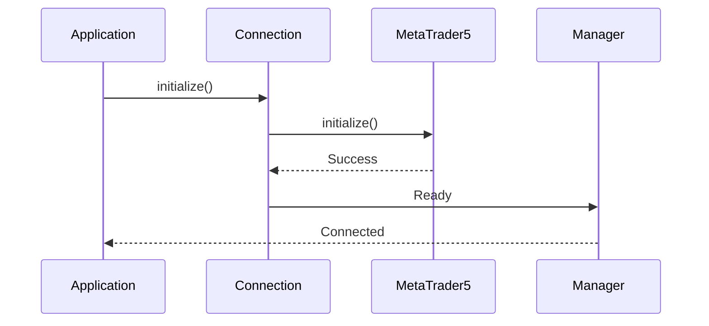

# Athena AI Terminal
# MetaTrader 5 (MT5) Integration

---

| Document Information | |
|----------------------|------------------------------------------------|
| Project | Athena AI Terminal |
| Document | MT5 Integration |
| Version | 1.0 |
| Status | Living Document |
| Last Updated | July 2026 |
| Audience | Backend Developers, Trading Engineers, DevOps, AI Assistants |

---

# Table of Contents

1. Introduction
2. Purpose
3. Design Philosophy
4. MT5 Module Overview
5. Folder Structure
6. MT5 Architecture
7. Connection Lifecycle
8. Market Data Flow
9. Candle Collection Pipeline
10. Symbol Management
11. Timeframe Mapping
12. Data Validation
13. Repository Integration
14. Scheduler Integration
15. Error Handling
16. Logging
17. Performance
18. Security
19. Future Enhancements
20. Troubleshooting
21. Related Documents

---

# 1. Introduction

Athena communicates with MetaTrader 5 using the official MetaTrader5 Python SDK.

MT5 is responsible only for supplying market data.

Athena is responsible for:

- Data validation
- Storage
- Technical analysis
- Smart Money analysis
- AI recommendation generation

No business logic exists inside MT5.

---

# 2. Purpose

The MT5 module provides a single abstraction layer between Athena and the MetaTrader terminal.

It is responsible for:

- Connecting
- Disconnecting
- Retrieving historical candles
- Reading live market data
- Symbol information
- Future order execution

Every interaction with MetaTrader must go through this layer.

---

# 3. Design Philosophy

The MT5 package follows several principles.

• Single responsibility

• Replaceable

• Testable

• Minimal coupling

Business logic never imports the MetaTrader5 SDK directly.

Instead:

```
Business Logic

↓

MT5 Manager

↓

Connection Layer

↓

MetaTrader5 SDK

↓

MetaTrader Terminal
```

---

# 4. MT5 Module Overview

```
app/mt5/

│

├── connection.py

├── manager.py

├── client.py

├── providers.py

├── interfaces.py

├── mappers.py

├── candle_collector.py

├── constants.py

└── services/
```

---

# 5. Folder Responsibilities

## connection.py

Responsible for

• Terminal initialization

• Login

• Shutdown

• Connection state

No candle processing occurs here.

---

## manager.py

Primary MT5 abstraction.

Responsibilities

• Symbol retrieval

• Historical candles

• Tick data

• Market information

• Future order operations

This is the module most backend services interact with.

---

## client.py

Low-level wrapper around the MetaTrader5 SDK.

Purpose

Reduce SDK-specific code throughout the application.

---

## interfaces.py

Defines abstract interfaces.

Allows future replacement of MT5 with another broker.

Future examples

• cTrader

• Interactive Brokers

• Binance

---

## providers.py

Provides configured MT5 services to the application.

Acts as a lightweight dependency provider.

---

## mappers.py

Converts raw MT5 responses into Athena domain objects.

Examples

MT5 Rates

↓

Market Candle

MT5 Tick

↓

Tick Model

---

## candle_collector.py

Responsible for historical candle synchronization.

Responsibilities

• Download candles

• Remove duplicates

• Validate data

• Store candles

No technical analysis occurs here.

---

## constants.py

Contains

Timeframes

Limits

Timeouts

Default values

SDK constants

---

# 6. MT5 Architecture

```mermaid
flowchart TD

Terminal

↓

MetaTrader5 SDK

↓

Connection

↓

Manager

↓

Collector

↓

Repository

↓

Database

↓

Analysis
```

---

# 7. Connection Lifecycle

Application Startup

↓

Initialize SDK

↓

Connect Terminal

↓

Authenticate

↓

Verify Connection

↓

Ready

Shutdown

↓

Stop Scheduler

↓

Disconnect MT5

↓

Shutdown SDK

---

# 8. Connection Workflow



---

# 9. Market Data Flow

```
MetaTrader

↓

copy_rates_from()

↓

Raw Candle Array

↓

Mapper

↓

Market Candle

↓

Repository

↓

Database
```

Only validated candles are stored.

---

# 10. Candle Collection Pipeline

Scheduler

↓

Collector

↓

Manager

↓

MetaTrader5

↓

Historical Rates

↓

Validation

↓

Duplicate Check

↓

Repository

↓

Database

↓

Analysis Engine

---

# 11. Symbol Management

Supported Symbols

Current

XAUUSD

Future

EURUSD

GBPUSD

USDJPY

BTCUSD

ETHUSD

US30

NAS100

SPX500

Every symbol should be configured centrally.

---

# 12. Timeframe Mapping

Athena Timeframe

↓

MT5 Constant

Examples

```
M1

↓

TIMEFRAME_M1

M5

↓

TIMEFRAME_M5

M15

↓

TIMEFRAME_M15

H1

↓

TIMEFRAME_H1

H4

↓

TIMEFRAME_H4

D1

↓

TIMEFRAME_D1
```

Mappings should exist in one location only.

---

# 13. Data Validation

Before storage every candle is validated.

Checks include

• Timestamp

• OHLC values

• Missing values

• Duplicate timestamps

• Invalid volume

Rejected candles are logged.

---

# 14. Repository Integration

Collector never performs SQL.

Instead

Collector

↓

Market Repository

↓

SQLAlchemy

↓

Database

This keeps MT5 independent of persistence.

---

# 15. Scheduler Integration

Current Scheduler

Every Minute

↓

Collect M1 Candles

↓

Save Database

↓

Run Analysis

↓

Generate Recommendation

Future

Multiple symbols

Multiple timeframes

Concurrent jobs

---

# 16. Error Handling

Typical MT5 Errors

Authorization failed

IPC timeout

Terminal not running

Invalid symbol

Market closed

Connection lost

Every failure should

Log

Retry (where appropriate)

Return meaningful exceptions

Avoid crashing the scheduler

---

# 17. Logging

MT5 logs include

Application startup

Terminal initialization

Authentication

Connection

Disconnection

Candle collection

Duplicate detection

Download duration

Failures

Example

```
Connected to MetaTrader 5.

Collected 500 candles.

Inserted 127 new candles.
```

---

# 18. Performance

Current optimizations

Duplicate detection

Batch inserts

Connection reuse

Repository abstraction

Future

Parallel downloads

Multi-symbol collection

Async processing

Incremental synchronization

Redis cache

---

# 19. Security

Credentials should never be hardcoded.

Use environment variables.

Current configuration

```
MT5_LOGIN

MT5_PASSWORD

MT5_SERVER

MT5_PATH
```

Never commit credentials to Git.

---

# 20. Future Enhancements

Planned improvements

Order execution

Position monitoring

Trade history

Economic calendar

Market depth

Tick streaming

Broker abstraction

Multiple terminals

Automatic reconnect

Health monitoring

---

# 21. Troubleshooting

## Authorization Failed (-6)

Possible causes

Wrong login

Wrong password

Wrong server

Terminal not logged in

---

## IPC Timeout (-10005)

Possible causes

Terminal frozen

Multiple terminals

Heavy CPU usage

Lost connection

---

## No Candles Returned

Possible causes

Market closed

Invalid symbol

Timeframe mismatch

Connection failure

---

## Duplicate Candles

Check

Unique constraint

Repository logic

Timestamp conversion

---

## Scheduler Stops Collecting

Check

Scheduler status

MT5 connection

Database

Logs

---

# Related Documents

05_Backend_Architecture.md

06_Database_Design.md

08_AI_Architecture.md

09_Indicator_Engine.md

11_Analysis_Engine.md

18_Deployment.md

99_AI_Continuation_Context.md

---

# Revision History

| Version | Date | Description |
|----------|------|-------------|
| 1.0 | July 2026 | Initial MT5 integration documentation |

---

**Document End**

© Athena AI Terminal Project
