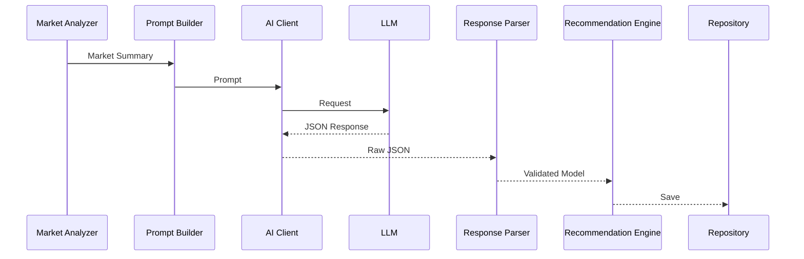

# Athena AI Terminal
# AI Architecture

---

| Document Information | |
|----------------------|------------------------------------------------|
| Project | Athena AI Terminal |
| Document | AI Architecture |
| Version | 1.0 |
| Status | Living Document |
| Last Updated | July 2026 |
| Audience | AI Engineers, Backend Developers, Architects, Data Scientists, AI Assistants |

---

# Table of Contents

1. Introduction
2. AI Vision
3. AI Design Principles
4. AI Module Structure
5. AI Architecture
6. AI Processing Pipeline
7. Recommendation Engine
8. Prompt Builder
9. AI Client
10. Response Parser
11. Recommendation Model
12. AI Data Flow
13. Market Context Generation
14. Technical Analysis Integration
15. Smart Money Concept Integration
16. Risk Analysis
17. Confidence Calculation
18. AI Response Validation
19. Error Recovery
20. Logging
21. Performance
22. Security
23. Multi-LLM Support
24. Future AI Roadmap
25. Best Practices
26. Appendix

---

# 1. Introduction

Athena's AI Engine converts structured market intelligence into explainable trading recommendations.

Unlike many trading systems that directly send raw price data to an LLM, Athena performs significant preprocessing before invoking AI.

The AI is responsible for:

- Interpreting market context
- Evaluating confluence
- Generating trading recommendations
- Providing human-readable reasoning
- Suggesting risk-aware trade setups

The AI does **not** directly access MetaTrader 5 or the database.

---

# 2. AI Vision

Athena aims to build an explainable AI trading assistant rather than an autonomous trading bot.

Key objectives:

- Explainable recommendations
- Structured outputs
- Risk awareness
- Human oversight
- Modular AI providers

The AI assists traders rather than replacing them.

---

# 3. AI Design Principles

The AI subsystem follows these principles:

- Provider independence
- Structured communication
- Deterministic prompts
- Strict response validation
- Fail-safe operation
- Explainability
- Minimal hallucination risk

---

# 4. AI Module Structure

```
app/ai/

│

├── client.py

├── prompt_builder.py

├── response_parser.py

├── recommendation_engine.py

├── models.py

└── __init__.py
```

Each module has a single responsibility.

---

# 5. AI Architecture

```mermaid
flowchart TD

Candles

-->

Indicator Engine

-->

Pattern Engine

-->

Market Analyzer

-->

Prompt Builder

-->

AI Client

-->

LLM

-->

Response Parser

-->

Recommendation Engine

-->

Repository

-->

Database
```

---

# 6. AI Processing Pipeline

Step 1

Historical candles are loaded.

↓

Step 2

Indicators are calculated.

↓

Step 3

Smart Money patterns are detected.

↓

Step 4

Market summary is generated.

↓

Step 5

Prompt Builder creates the AI prompt.

↓

Step 6

AI Client sends the prompt to the selected LLM.

↓

Step 7

LLM returns structured JSON.

↓

Step 8

Response Parser validates the response.

↓

Step 9

Recommendation Engine enriches the recommendation.

↓

Step 10

Recommendation is stored in PostgreSQL.

---

# 7. Recommendation Engine

Primary file:

```
recommendation_engine.py
```

Responsibilities:

- Coordinate the AI workflow
- Build prompts
- Invoke the AI client
- Parse responses
- Apply fallback logic
- Produce validated recommendations

It acts as the orchestration layer for all AI-related processing.

---

# 8. Prompt Builder

Primary file:

```
prompt_builder.py
```

Responsibilities:

- Convert market analysis into natural language
- Define AI instructions
- Specify output format
- Include technical indicators
- Include Smart Money Concepts
- Include risk context

Prompt sections typically include:

- Market summary
- Indicator values
- Trend
- Support and resistance
- Pattern detection
- Risk metrics
- Expected JSON schema

The prompt should be deterministic and version-controlled.

---

# 9. AI Client

Primary file:

```
client.py
```

Responsibilities:

- Communicate with the LLM
- Handle HTTP requests
- Manage timeouts
- Retry transient failures
- Log requests and responses

Current provider:

- Ollama

Current model:

```
llama3.2
```

Future providers:

- OpenAI
- Claude
- Gemini
- DeepSeek
- Mistral
- Azure OpenAI
- AWS Bedrock

The business layer communicates only with the AI client abstraction.

---

# 10. Response Parser

Primary file:

```
response_parser.py
```

Responsibilities:

- Parse JSON responses
- Validate schema
- Convert to domain models
- Reject malformed outputs
- Apply defaults where appropriate

Validation prevents invalid recommendations from entering the system.

---

# 11. Recommendation Model

The AI recommendation includes fields such as:

- signal
- confidence
- entry_price
- stop_loss
- take_profit
- risk_reward
- trend
- confluence
- reasoning
- warnings

The schema is defined using Pydantic.

---

# 12. AI Data Flow



---

# 13. Market Context Generation

The AI never receives raw OHLC data directly.

Instead, Athena provides a summarized market context containing:

- Current trend
- EMA alignment
- RSI
- MACD
- ATR
- Volatility
- Liquidity zones
- Order blocks
- Fair Value Gaps
- Break of Structure
- Change of Character
- Multi-timeframe confluence

This reduces prompt size and improves consistency.

---

# 14. Technical Analysis Integration

Indicators supplied to the AI may include:

- EMA 20
- EMA 50
- EMA 200
- RSI
- MACD
- ATR
- Volume
- Candle statistics

Indicators are calculated before prompt generation.

---

# 15. Smart Money Concept Integration

Detected patterns may include:

- Break of Structure (BOS)
- Change of Character (CHOCH)
- Order Blocks
- Fair Value Gaps (FVG)
- Liquidity sweeps
- Premium / Discount zones
- Trend structure

Only validated patterns are included in the prompt.

---

# 16. Risk Analysis

The AI receives risk-related information, including:

- Proposed entry
- Stop loss
- Take profit
- Risk/Reward ratio
- Market volatility
- Trend strength

The AI should recommend only setups with acceptable risk characteristics.

---

# 17. Confidence Calculation

The AI returns a confidence score representing its assessment of the recommendation.

Confidence should be interpreted alongside:

- Indicator alignment
- Pattern confluence
- Market structure
- Risk metrics

Future versions may combine AI confidence with algorithmic confidence to produce a composite score.

---

# 18. AI Response Validation

Every AI response is validated before use.

Validation checks include:

- Valid JSON
- Required fields present
- Enum values are supported
- Numeric ranges are reasonable
- No missing mandatory values

Invalid responses trigger fallback logic.

---

# 19. Error Recovery

Possible failures include:

- LLM unavailable
- Network timeout
- Invalid JSON
- Unsupported response
- Empty response

Recovery strategies:

- Retry request
- Log error
- Generate fallback recommendation
- Prevent application failure

The AI subsystem must fail safely.

---

# 20. Logging

AI logs include:

- Prompt generation
- Request duration
- Selected model
- Response time
- Validation results
- Parsing failures
- Recommendation creation

Sensitive prompt data should be sanitized where appropriate.

---

# 21. Performance

Performance considerations:

- Compact prompts
- Reusable market summaries
- Efficient parsing
- Response caching (future)
- Batch analysis (future)

Large prompts should be avoided to reduce latency.

---

# 22. Security

Current measures:

- Local AI execution
- No external API keys for Ollama
- Environment-based configuration
- Response validation

Future considerations:

- Provider-specific secrets
- Request signing
- Audit logging
- Prompt version tracking

---

# 23. Multi-LLM Support

The architecture supports interchangeable providers.

```text
Recommendation Engine

↓

AI Client Interface

↓

Ollama
OpenAI
Claude
Gemini
DeepSeek
Mistral
Azure OpenAI
AWS Bedrock
```

Adding a new provider should require only a new client implementation.

---

# 24. Future AI Roadmap

Planned enhancements include:

- Multi-agent analysis
- News summarization
- Economic calendar reasoning
- Portfolio optimization
- Reinforcement learning experiments
- Strategy generation
- Self-evaluation
- Prompt versioning
- Confidence calibration
- AI memory integration

---

# 25. Best Practices

- Keep prompts deterministic.
- Validate every AI response.
- Never trust raw LLM output.
- Separate prompt generation from business logic.
- Log failures with context.
- Version prompts.
- Keep provider-specific logic isolated.

---

# 26. Appendix

## AI Workflow Summary

```text
Market Data

↓

Indicators

↓

Pattern Detection

↓

Market Summary

↓

Prompt Builder

↓

AI Client

↓

LLM

↓

Response Parser

↓

Recommendation Engine

↓

Database

↓

REST API / WebSocket
```

---

# Related Documents

- 05_Backend_Architecture.md
- 06_Database_Design.md
- 07_MT5_Integration.md
- 09_Indicator_Engine.md
- 10_Pattern_Engine.md
- 11_Analysis_Engine.md
- 12_API_Documentation.md
- 99_AI_Continuation_Context.md

---

## Revision History

| Version | Date | Description |
|----------|------|-------------|
| 1.0 | July 2026 | Initial AI architecture documentation |

---

**Document End**

© Athena AI Terminal Project
