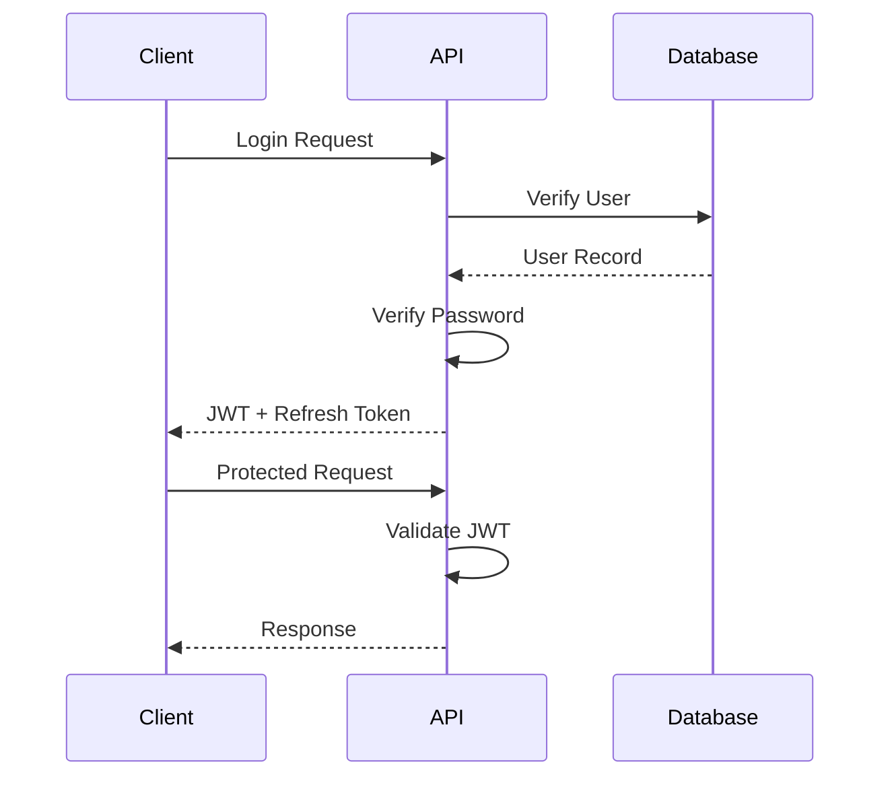

# Athena AI Terminal
# Authentication & Authorization

---

| Document Information | |
|----------------------|------------------------------------------------|
| Project | Athena AI Terminal |
| Document | Authentication & Authorization |
| Version | 1.0 |
| Status | Living Document |
| Last Updated | July 2026 |
| Audience | Backend Developers, Frontend Developers, DevOps Engineers, Security Engineers, AI Assistants |

---

# Table of Contents

1. Introduction
2. Objectives
3. Security Principles
4. Authentication Architecture
5. Authorization Architecture
6. Authentication Flow
7. User Roles
8. Permission Model
9. JWT Authentication
10. Refresh Tokens
11. Password Management
12. Session Management
13. API Security
14. WebSocket Security
15. Service-to-Service Authentication
16. Audit Logging
17. Security Headers
18. Future Enhancements
19. Best Practices
20. Related Documents

---

# 1. Introduction

Authentication verifies **who** is accessing Athena.

Authorization determines **what** that authenticated user is allowed to do.

The two concerns are intentionally separated to simplify maintenance, testing, and future expansion.

---

# 2. Objectives

The authentication subsystem must provide:

- Secure login
- Secure logout
- Identity verification
- Access control
- Token management
- Password security
- Session validation
- Auditability

---

# 3. Security Principles

Athena follows these principles:

- Least privilege
- Zero trust
- Defense in depth
- Secure by default
- Short-lived credentials
- Strong password hashing
- Token expiration
- Complete audit trail

---

# 4. Authentication Architecture

```text
Client

↓

Login Request

↓

Authentication Service

↓

User Repository

↓

Password Verification

↓

JWT Generation

↓

Client
```

---

# 5. Authorization Architecture

```text
Client

↓

JWT Middleware

↓

Permission Validation

↓

API Router

↓

Service Layer

↓

Repository
```

Authorization occurs before business logic is executed.

---

# 6. Authentication Flow



---

# 7. User Roles

Current development role:

```
Developer
```

Future roles:

```
Administrator

Trader

Viewer

Analyst

API Client
```

Each role has an associated permission set.

---

# 8. Permission Model

Permissions should be granular.

Examples:

```
market.read

market.write

recommendation.read

recommendation.generate

watchlist.read

watchlist.write

settings.read

settings.update

admin.users.manage

admin.system.manage
```

Permissions should be independent of roles.

Roles are collections of permissions.

---

# 9. JWT Authentication

Future authentication uses JSON Web Tokens.

Structure:

```
Header

↓

Payload

↓

Signature
```

Example payload:

```json
{
  "sub": "user_id",
  "username": "athena_user",
  "role": "Trader",
  "permissions": [
    "market.read",
    "recommendation.read"
  ],
  "exp": 1780000000
}
```

JWT should be signed using a secure secret key.

---

# 10. Refresh Tokens

Access Tokens

- Short lifetime
- Sent with every request

Refresh Tokens

- Longer lifetime
- Used to obtain new access tokens
- Stored securely
- Revocable

Recommended lifetimes:

| Token | Lifetime |
|--------|-----------|
| Access Token | 15–30 minutes |
| Refresh Token | 7–30 days |

---

# 11. Password Management

Passwords must never be stored in plaintext.

Recommended algorithm:

```
bcrypt
```

Requirements:

- Minimum length
- Mixed case
- Numbers
- Special characters
- Password confirmation
- Password reset support

Future:

- Password history
- Breach detection
- MFA support

---

# 12. Session Management

Authentication lifecycle:

```
Login

↓

JWT Issued

↓

Authenticated Requests

↓

Refresh

↓

Logout

↓

Token Revoked
```

Server-side token revocation may be implemented for enhanced security.

---

# 13. API Security

Protected endpoints require:

```
Authorization: Bearer <JWT>
```

Validation steps:

1. Verify signature
2. Verify expiration
3. Verify issuer
4. Verify audience
5. Verify permissions

Only then should the request proceed.

---

# 14. WebSocket Security

Future WebSocket authentication:

```
Client

↓

JWT

↓

WebSocket Handshake

↓

Authentication

↓

Connection Accepted
```

Authenticated connections inherit user permissions.

---

# 15. Service-to-Service Authentication

Future internal services should authenticate independently.

Possible mechanisms:

- Mutual TLS
- Service Tokens
- Signed Requests

This supports future microservice architectures.

---

# 16. Audit Logging

Authentication events should be recorded.

Examples:

- Login
- Logout
- Failed login
- Password change
- Token refresh
- Permission denial

Example log:

```text
2026-07-15 12:30:05

User: trader01

Action: LOGIN_SUCCESS

IP: 192.168.1.15
```

Audit logs should be immutable.

---

# 17. Security Headers

Recommended HTTP headers:

```
Strict-Transport-Security

Content-Security-Policy

X-Frame-Options

X-Content-Type-Options

Referrer-Policy

Permissions-Policy
```

CORS should be configured explicitly for trusted origins.

---

# 18. Future Enhancements

Planned features:

- Multi-Factor Authentication (MFA)
- OAuth2
- OpenID Connect
- Google Login
- Microsoft Login
- GitHub Login
- Hardware Security Keys
- Biometric authentication
- Device management
- Session dashboard

---

# 19. Best Practices

- Never store plaintext passwords.
- Keep access tokens short-lived.
- Rotate secrets periodically.
- Validate every request.
- Log authentication events.
- Use HTTPS in production.
- Apply least-privilege permissions.
- Separate authentication from authorization.
- Treat all client input as untrusted.

---

# 20. Related Documents

- 05_Backend_Architecture.md
- 06_Database_Design.md
- 13_REST_API.md
- 14_WebSocket_Architecture.md
- 16_Background_Scheduler.md
- 19_Deployment_Guide.md
- 99_AI_Continuation_Context.md

---

# Revision History

| Version | Date | Description |
|----------|------|-------------|
| 1.0 | July 2026 | Initial authentication and authorization documentation |

---

**Document End**

© Athena AI Terminal Project
